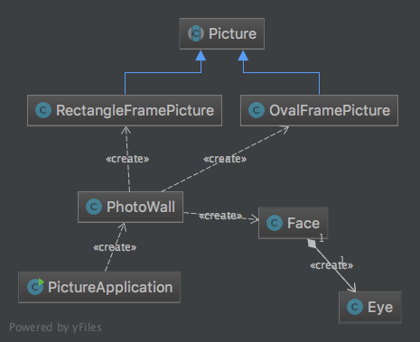

Comp 124 - Homework #3 : A Picture Wall
===

# Overview

In this activity your goal is to craete a graphics application that will draw a wall full of framed pictures.
We are not putting a lot of restrictions on this - your pictures can contain any art (although they must not be blank) 
and you can lay out your pictures houwever you want. 
The goal of this activity is to practice more object oriented decomposition of problems using a class hierarchy and an abstract class.

The classes that you will create will be related as shown in this diagram.
Note, the diagram shows a `Face` and an `Eye`, however, we do not require these specific classes, these are just an example
of the classes you might write to enable picture content.
 

## Requirements

1. You are given one abstract class called `Picture`, which extends `GraphicsGroup`. 
You must use it.
2. You must make a minimum of 2 subclasses of `Picture`:
    a. `OvalFramePicture`, whose shape is an oval with an oval frame.
    b. `RectangleFramePicture`, whose shape is a rectangle.
3. You must make a class called `PhotoWall` the extends `CanvasWindow`. 
4. The window created by the code in `PhotoWall` must contain a minimum of 4 pictures of varying sizes-
at least 2 `OvalFramePicture` objects and 2 `RectanglePicture` objects.
You must have at least three different sizes of pictures showing.
If you make another subclass of `Picture` please add additional pictures to the `PhotoWall` showing off those classes.
5. Each of your pictures must contain at least one object of type `GraphicsGroup`, such as the
`Face` from the class activity, or the `Train`, or other simple drawings of some kind, such as flags-
this is your chance to be creative.
6. Your main application class, called `PictureApplication`, should create a new
`PhotoWall` in its main() method. It should have no other behavior as the `PhotoWall` class should be responsible for defining
what a photo wall is and should look like.

### Suggestions for completing the assignment.

 * You will be implementing subclasses of the `Picture` class.
Start by understanding what that class is and what its methods are supposed to do.

 * Once you understand the `Picture` class focus on implementing one subclass at a time.

 * Test each class carefully. This does not need to be unit tests like last homework (in fact its probably impossible to do with unit tests). 
 You may find it useful, however, to get your first pictured drawing on the wall before trying to build a second picture class.

 * Each picture is a GraphicsGroup - adding content to a picture frame, therefore, can be done using its `add(GraphicsObject)` method.

 * Make sure that you can change the size of your picture and properly display it on the
PhotoWall.

### Submit your asssignment.
1. Commit your changes: Select the 124-hw3 module, right click, and select Git -> Commit Directory.
2. You should see all the source files you changed with a checkmark in the popup.
3. Change the "commit" button to "commit and push" in the lower righthand corner.
4. Write an appropriate message in the comment box.
5. IMPORTANT: Select *"commit and push"* (not just commit) in the lower right.
6. Select "push" to send your changes to GitHub.
7. IntelliJ should say "push successful"
8. Visit your github site in your web browser to make sure the changes you made were pushed correctly.
9. If you want to be _very_ sure everything is correct - check-out a copy of your code and test it again!